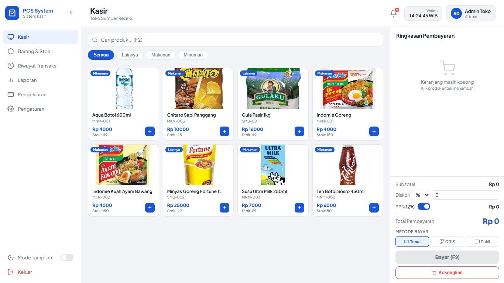
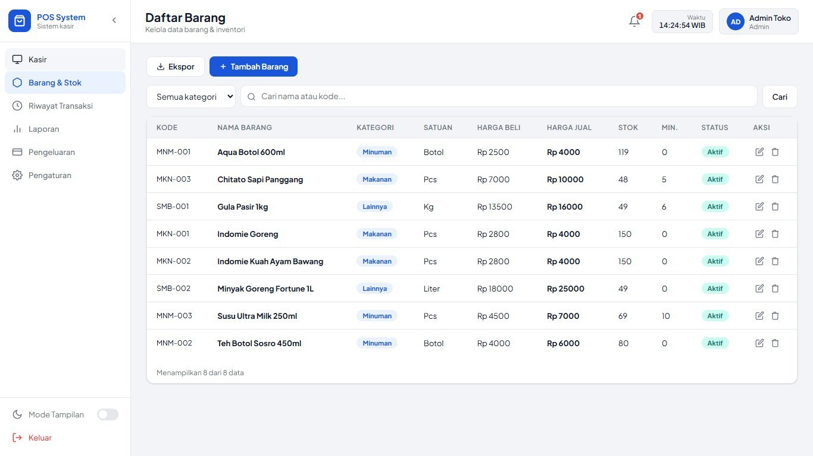
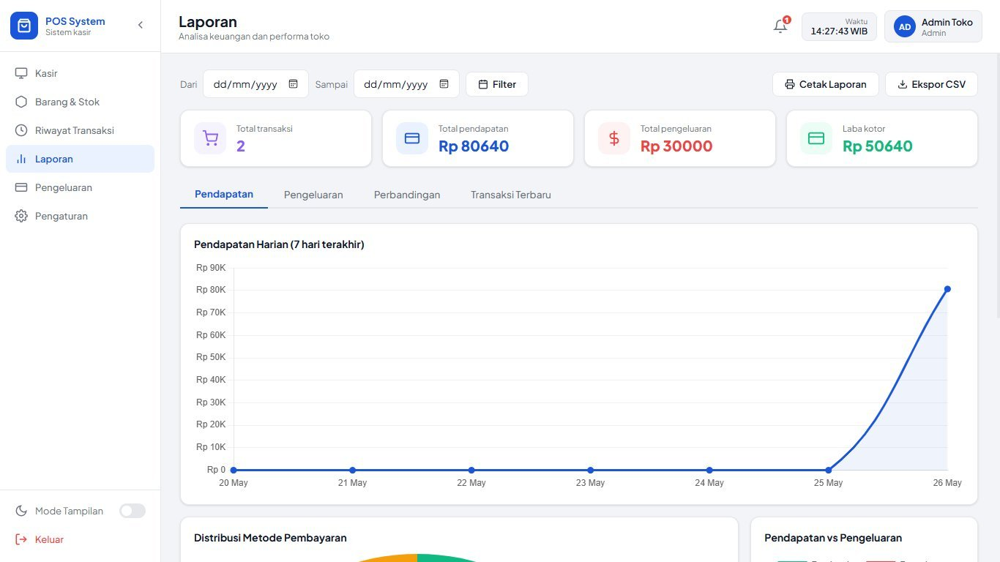
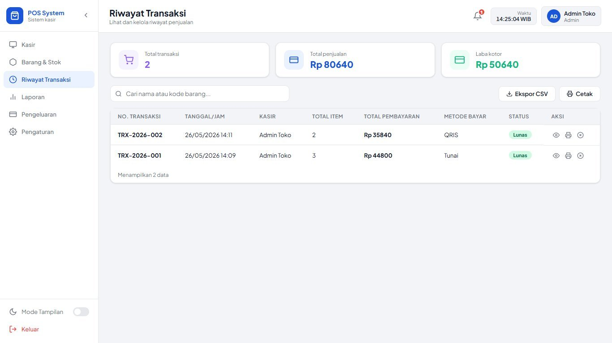
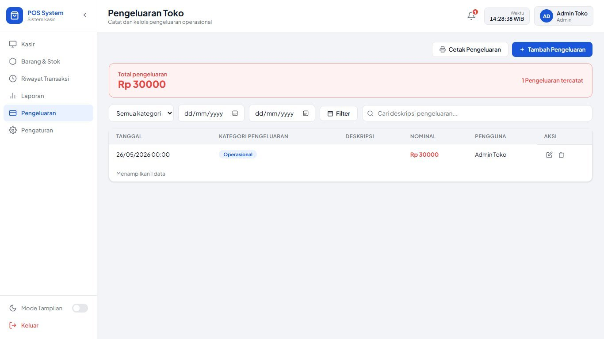
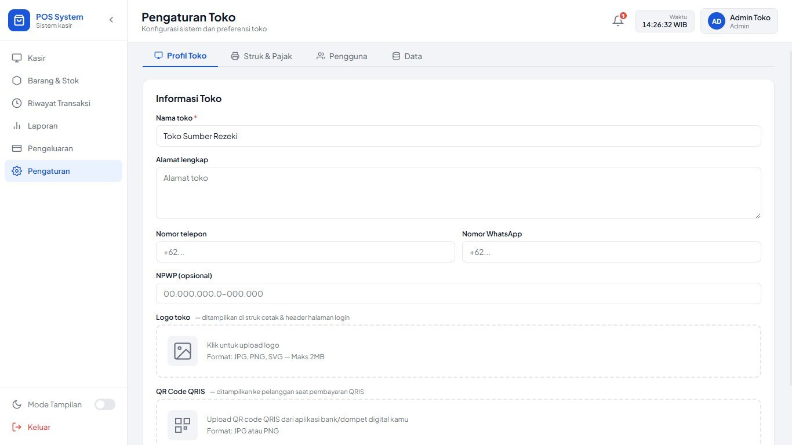

# 🛒 POS System — Sistem Kasir Berbasis Web

> Sistem Point of Sale berbasis web yang dibangun dengan Django — ringan, cepat, dan siap pakai tanpa instalasi rumit. Dirancang untuk mengelola transaksi penjualan, stok produk, pengeluaran operasional, hingga laporan keuangan dalam satu platform terpadu. Cocok untuk toko retail, warung makan, hingga minimarket kecil yang butuh sistem kasir yang handal tanpa biaya lisensi.


---

## 📸 Tampilan Aplikasi

### Kasir — Transaksi Penjualan


### Barang & Stok — Manajemen Produk


### Laporan — Dashboard Keuangan


### Riwayat Transaksi


### Pengeluaran Toko


### Pengaturan Toko


---

## ✨ Fitur Utama

| Modul | Deskripsi |
|-------|-----------|
| 🖥️ **Kasir** | Pilih produk dari katalog, keranjang belanja real-time, diskon & PPN otomatis, bayar Tunai / QRIS / Debit, cetak struk thermal |
| 📦 **Produk & Stok** | Tambah/edit/hapus produk dengan foto, kelola kategori, alert stok rendah |
| 🧾 **Riwayat Transaksi** | Lihat detail tiap transaksi, cetak ulang struk, batalkan transaksi + stok otomatis kembali |
| 📊 **Laporan** | Grafik pendapatan 7 hari, rekap omzet/pengeluaran/laba bersih, distribusi metode pembayaran |
| 💸 **Pengeluaran** | Catat biaya operasional per kategori (sewa, listrik, dll), lampirkan bukti |
| ⚙️ **Pengaturan** | Profil toko, logo, QRIS, format nomor transaksi, ukuran kertas printer, manajemen user |

---

## 🚀 Cara Menjalankan

### Prasyarat
- Python 3.10+
- pip

### Instalasi (1 perintah)

```bash
git clone https://github.com/elsaveroo/pos-system.git
cd pos-system
python setup.py
```

> Script `setup.py` otomatis menginstall dependencies, migrasi database, dan mengisi data demo.

### Instalasi Manual

```bash
# 1. Clone & masuk folder
git clone https://github.com/elsaveroo/pos-system.git
cd pos-system

# 2. (Opsional) Buat virtual environment
python -m venv venv
source venv/bin/activate        # Linux/Mac
venv\Scripts\activate           # Windows

# 3. Install dependencies
pip install -r requirements.txt

# 4. Salin dan isi file environment
cp .env.example .env
# Buka .env lalu isi SECRET_KEY

# 5. Migrasi database
python manage.py migrate

# 6. Isi data awal (produk + user demo)
python manage.py shell < seed_data.py

# 7. Jalankan server
python manage.py runserver
```

Buka browser: **http://127.0.0.1:8000**

---

## 🔑 Akun Demo

| Role  | Username | Password   | Akses |
|-------|----------|------------|-------|
| Admin | `admin`  | `admin123` | Semua fitur + pengaturan |
| Kasir | `kasir1` | `kasir123` | Kasir, riwayat, laporan |

Admin panel Django: `http://127.0.0.1:8000/admin/`

---

## 🔐 Environment Variables

Salin `.env.example` menjadi `.env` lalu sesuaikan:

```bash
cp .env.example .env
```

| Variable | Keterangan | Default |
|----------|------------|---------|
| `SECRET_KEY` | Django secret key — **wajib diisi** | — |
| `DEBUG` | Mode debug | `True` |
| `ALLOWED_HOSTS` | Host yang diizinkan, pisah koma | `*` |

---

## 🗂️ Struktur Proyek

```
pos-system/
│
├── config/                     # Konfigurasi Django
│   ├── settings.py             # Pengaturan aplikasi (SECRET_KEY dari .env)
│   ├── urls.py                 # URL root
│   ├── asgi.py
│   └── wsgi.py
│
├── kasir/                      # Aplikasi utama
│   ├── models.py               # Model: Produk, Transaksi, Pengeluaran, dll
│   ├── views/                  # Views dipisah per fitur (MVT)
│   │   ├── __init__.py         # Re-export semua view
│   │   ├── _helpers.py         # Fungsi utilitas bersama
│   │   ├── auth.py             # Login & logout
│   │   ├── kasir.py            # Halaman kasir, simpan & batal transaksi
│   │   ├── produk.py           # CRUD produk & halaman barang stok
│   │   ├── kategori.py         # CRUD kategori produk
│   │   ├── transaksi.py        # Riwayat, ekspor CSV, reset data
│   │   ├── laporan.py          # Dashboard laporan keuangan
│   │   ├── pengeluaran.py      # CRUD pengeluaran operasional
│   │   ├── pengaturan.py       # Pengaturan toko & manajemen user
│   │   ├── notifikasi.py       # API notifikasi stok rendah/habis
│   │   └── setup.py            # First-run setup otomatis
│   ├── urls.py                 # Routing URL kasir
│   ├── admin.py                # Registrasi admin panel
│   └── migrations/             # Migrasi database
│
├── templates/
│   └── kasir/                  # Template HTML tiap halaman
│       ├── base.html           # Layout utama + navigasi
│       ├── kasir.html          # Halaman transaksi kasir
│       ├── barang_stok.html    # Manajemen produk & stok
│       ├── riwayat.html        # Riwayat transaksi
│       ├── laporan.html        # Dashboard laporan
│       ├── pengeluaran.html    # Catat pengeluaran
│       ├── pengaturan.html     # Pengaturan toko
│       └── login.html
│
├── static/
│   ├── css/main.css            # Styling utama
│   └── js/main.js              # JavaScript interaktif
│
├── docs/
│   └── screenshots/            # Screenshot tampilan aplikasi
│
├── .env.example                # Template environment variables
├── .gitignore
├── requirements.txt            # Dependencies: Django, Pillow, python-decouple
├── seed_data.py                # Script data awal demo
├── setup.py                    # Script setup otomatis (1 perintah)
└── manage.py
```

---

## 🔌 API Endpoints

### Produk
| Method | Endpoint | Deskripsi |
|--------|----------|-----------|
| `GET` | `/api/produk/` | Daftar semua produk aktif |
| `GET` | `/api/produk/<id>/` | Detail satu produk |
| `POST` | `/api/produk/tambah/` | Tambah produk baru |
| `POST` | `/api/produk/edit/<id>/` | Update data produk |
| `DELETE` | `/api/produk/hapus/<id>/` | Hapus produk |

### Transaksi
| Method | Endpoint | Deskripsi |
|--------|----------|-----------|
| `POST` | `/api/transaksi/simpan/` | Simpan transaksi baru |
| `GET` | `/api/transaksi/<id>/` | Detail transaksi |
| `POST` | `/api/transaksi/batal/<id>/` | Batalkan + kembalikan stok |

### Pengeluaran
| Method | Endpoint | Deskripsi |
|--------|----------|-----------|
| `POST` | `/api/pengeluaran/tambah/` | Catat pengeluaran |
| `DELETE` | `/api/pengeluaran/hapus/<id>/` | Hapus pengeluaran |

### Lainnya
| Method | Endpoint | Deskripsi |
|--------|----------|-----------|
| `GET` | `/api/notifikasi/` | Notifikasi stok rendah/habis |
| `GET` | `/api/kategori/` | Daftar kategori produk |
| `GET` | `/api/ekspor/transaksi/` | Ekspor semua transaksi (JSON) |

---

## 🛠️ Tech Stack

- **Backend** — Django 6.0 (Python 3.10+)
- **Database** — SQLite (dev) — mudah diganti PostgreSQL untuk production
- **Frontend** — HTML5, CSS3, Vanilla JavaScript (tanpa framework)
- **Printing** — Browser Print API (thermal 58mm / 80mm / A4)
- **Auth** — Django built-in authentication
- **Config** — python-decouple (environment variables)
